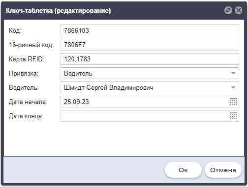

### Оборудование:
* [umka310](../umka310.md) (RS-485)
* RFID считыватель ERF - 01 (RS-485)

### Конфигурация оборудования ERF - 01:
[Документация](https://exzotron.ru/wp-content/uploads/2016/06/ERF-01.pdf)
* [LLS](../../info/dataFormat/LLS/LLS.md) адрес по умолчанию `0` (перемычки сняты) 
* Скорость 19200 (по умолчанию)

Подключение проводом по RS-485 (`A` к `A` к `B` к `B`)

Во время передачи по RS-485 мигает синий светодиод (внутренний).

### Конфигурация оборудования Умка310:
[Документация](https://trivi.ru/static/files/common/UMKa/rukovodstvoumka310.pdf)
* [LLS](../../info/dataFormat/LLS/LLS.md) адрес ДУТ `0` (Если не занят)
* Скорость 19200 (по умолчанию)
* Передача данных происходит по протоколу LLS (передает id карты в формате температуры и объема)

### Конфигурация Агросигнал:

* Добавить ключ в списке ключей
* Добавить на технике компонент "Считыватель ключа", 
* * Поставить галочку LLS - протокол
* * Указать имя 2 портов `A:fuel1`, `A:temp1`
* * Тип ключа: Водитель
* * Считывать данные: Всегда

После установки ключа в считыватель в системе отобразится имя водителя. 