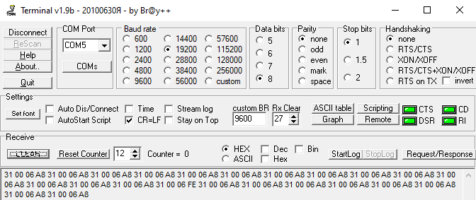

# LLS протокол (python)
LLS протокол используется в промышленности и позволяет по RS-485 передавать данные с датчиков уровня топлива (уровень и температуру)
В качестве переходника используется конвертер rs-485->UART

## Подключение к устройству
В качестве устройства буду использовать [Умка 310](../../../device/Умка%20310.md). Трекер работает в режиме `master` и отправляет запросы на ведомые (`slave`) устройства.

Через переходник RS-485->UART приходят данные в последовательный порт (COM port):

Среди массива данных (`master`) можно выделить байты в 16-й системе счисления:  
`31 00 06 A8` 
* 31 - префикс, 
* 00 - адреса запрашиваемого устройства
* 06 - код операции ()
* A8 - контрольная сумма

### Команды (3-й байт):
|  Код  |                 Описание                 |                   Данные                    |
| :---: | :--------------------------------------: | :-----------------------------------------: |
|  06h  |      Однократное считывание данных       | Относительный уровень, температура, частота |
|  07h  |       Периодическая выдача данных        |
|  13h  | Изменение интервала периодической выдачи |                 От 0 до 255                 |
|   *   |                    *                     |                      *                      |
|  10h  |     Чтение текущих настроек датчика      |          Название, интервалы, ...           |

## Взаимодействие с микроконтроллером

Преобразование строки в байты и обратно в массив байтов. Байты расположены согласно протоколу (префикс, адрес, код операции, ...)

Запрос: `31 01 06 6C` --> `b'1\x00\x06\xa8'`  
Ответ: `b'>\x00\x06\xe4\\>\x00\x00\xd2'` --> `3e0006e45c3e0000d2` --> `['3e', '00', '06', 'e4', '5c', '3e', '00', '00', 'd2']`

## Подсчет контрольной суммы
Просчет контрольной суммы производится табличным методом [Документация](https://doc.omnicomm.ru/ru/omnicomm_lls-integration/algorithm). 
Алгоритм для python и инструменты находятся в [скрипте](LLSprotocol.py) 

## Источники:
* [Script](LLSprotocol.py)
* [Видео](https://www.youtube.com/watch?v=pc8Wu1GhmnE)
* [Документация](.md)
* [Весовой контроллер (док.)](док.)))

