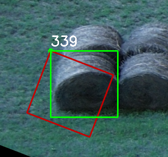

# 1. Установка label-studio (linux)

Программа устанавливается отдельно от проектов. В дальнейшем используется в других проектах.

    mkdir -p /home/app/LS   # Создаем папку LS (labelStudio)
    cd /home/app/LS         # Переходим в неё

Внутри папки /home/app/LS:

    python3 -m venv LS_env      # Создаем виртуальное окружение LS_env (Только 1 раз)
    source LS_env/bin/activate  # Активируем виртуальное окружение
    pip install label-studio    # Устанавливаем label-studio в внутри виртуального окружения
    label-studio                # Запуск 
    

Ждем установки и командой `label-studio` запускаем программу в браузере на предложенном порту (`localhost:8080`)

    pip install -U label-studio # Обновление программы по необходимости

Размечаем наш датасет.

## Нюансы
1. При разметке датасета рамками с поворотом, необходимо сохранять в формате json или json-mini только в этих форматах содержится информация о повороте. При попыте обучить нейронку на других форматах угол наклона не будет учитываться и разметка будет смещена   
*(Зеленым размечено с учётом угла (339 гр.), красным без учета угла)*
2. При нарезке датасета использовал самописный [скрипт](slicer_json-min.py).
    **Алгоритм:** 
   * Поиск центра рамки
   * Вращение рамки согласно json файлу 
3. При сохранении json файла в Label Studio возможны пропуски привязки угла (отображает 0). Исправляется небольшим перемещением снимка и пересохранением файла. 

## Экспорт данных

Label Studio позволяет экспортировать даннные в различных форматах:

|     Формат     |                            Тип                            |       Примечание       |
| :------------: | :-------------------------------------------------------: | :--------------------: |
|      JSON      |                             -                             | Содержит угол поворота |
|    JSON-MIN    |                             -                             | Содержит угол поворота |
|      CSV       |                             -                             |           -            |
|      TSV       |                             -                             |           -            |
|      COCO      | <kbd>image segmentation</kbd> <kbd>object detection</kbd> |           -            |
| Pascal VOC XML | <kbd>image segmentation</kbd> <kbd>object detection</kbd> |           -            |
|      YOLO      | <kbd>image segmentation</kbd> <kbd>object detection</kbd> |           -            |

## Источники:
+ [Cпециализированные программы для разметки (видео)](видео))))